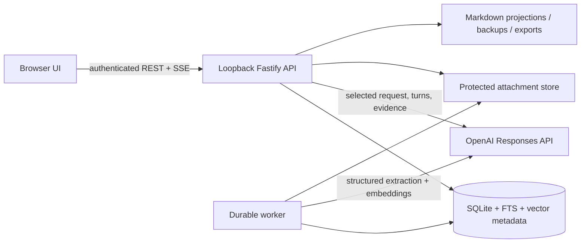

# Architecture

## Product boundary

Continuum is a single-user local browser application. The browser is presentation, the loopback API owns commands and streaming, and the worker owns durable background jobs. SQLite is the primary transactional authority shared by both processes; the content-addressed attachment store and external maintenance markers are also part of the crash-recovery boundary. In-memory state may accelerate delivery but must never be required to recover a run, job, import, or deletion.

The supported launch path binds to `127.0.0.1`, creates a new session token per backend launch, and opens a bootstrap URL that exchanges the launch token for an HttpOnly, SameSite=Strict cookie. API mutations additionally require a custom CSRF header. Host, Origin, CORS, CSP, and rate-limit checks narrow the local-browser attack surface.

## Monorepo responsibilities

| Area | Responsibility |
|---|---|
| `apps/web` | One timeline, onboarding, composer, search, memory/debug drawer, graph, settings. |
| `apps/api` | Security boundary, commands, reads, SSE, response orchestration, portability. |
| `apps/worker` | Attachment extraction, memory compilation, embeddings, lint, rebuilds. |
| `packages/contracts` | Runtime-validated domain and stream schemas. |
| `packages/database` | Migrations, repositories, FTS/vector startup, job queue, integrity. |
| `packages/memory` | Structured deltas, claims, entities, temporal policy, topic pages, lint. |
| `packages/retrieval` | Classification, candidate channels, fusion, reranking, graph, context budget. |
| `packages/tools` | Exact-memory, workspace-read, web, and isolated execution boundaries. |
| `packages/evaluation` | Datasets, baselines, metrics, budget guard, reports, fixture runner. |

## Conversation flow

1. The browser submits content, ready attachment IDs, quality, and an idempotency key.
2. The API commits the user event and creates a run before provider work.
3. Retrieval classifies the request and runs lexical, vector, recency, entity, pinned, temporal, and graph channels according to feature flags.
4. Reciprocal-rank fusion and optional reranking select a bounded evidence packet. The trace and packet hash are persisted.
5. The provider streams deltas with provider storage disabled. Stream events are persisted before publication.
6. Completion activates an assistant revision, records usage/cost, and enqueues memory compilation.
7. The worker extracts durable changes and commits claims, pages, edges, and index metadata transactionally. Filesystem projections, embeddings, and privacy cleanup are recoverable follow-up effects; a database commit alone does not certify those effects complete.

The implementation must treat post-response SSE refresh, crash reconciliation, and exact tool rounds as durable cross-process protocols—not as assumptions about a shared event emitter.

## Storage and indexing

- SQLite uses WAL, foreign keys, secure delete, a busy timeout, and explicit versioned migrations. The current source schema is version 17.
- Raw event content is separate from event metadata and indexed through FTS5.
- Sources, chunks, claims, and topic revisions retain provenance IDs.
- Vector rows include model, dimensions, content hash, and embedding version. Retrieval selects only rows for the exact configured model, and embedding jobs bind both that model and the authoritative source generation/content hash. The installed `sqlite-vec` binary is loaded automatically; an environment-supplied extension path is an optional development override, not a normal installation step.
- Attachments use content-addressed protected storage; database rows provide provenance and extraction state. Blob publication and deletion fsync the file and affected containing directories before the corresponding operation can be acknowledged.
- Jobs have idempotency keys, leases, heartbeats, attempts, backoff, and terminal visibility.

Re-extracting a byte-identical source preserves its stable chunk IDs while refreshing parser, chunker, location, token, and source metadata. If the bytes or chunk identities change, dependent provenance, claims, vectors, search rows, generated topic families, and projections are invalidated before the rebuild is exposed, so stale derived memory cannot remain searchable.

### Protected topic updates

Topic trust is an explicit sticky policy, independent of whichever revision is active. `automatic` pages may activate compiler revisions directly. A user edit sets `update_policy=confirm`; later model or system revisions cannot silently clear it, and migration 16 backfills confirmation mode when any historical user-authored revision exists.

For a confirmation-only topic, the worker persists a normalized proposal with patch, route, output, and claim-guard rows. A protected inline topic uses the same review boundary for a one-time inline-to-sharded conversion; it does not silently rewrite the user-controlled page before acceptance. Candidate pages and revisions are inactive and absent from default FTS, graph links, projection files, and retrieval. Parent, base-shard, rendered-claim, evidence, routing, and candidate-content fingerprints form an atomic compare-and-swap boundary for acceptance; rejection cannot mutate active memory. Separate untouched proposals may be rebased after an acceptance, while overlapping material is merged or superseded. Legacy pre-normalization proposals do not contain these exact guards, so their accept action is blocked; they remain reject-only and the compiler must create a normalized replacement. This is an O(delta)-oriented design, not empirical proof that every compiler path is O(delta); automatic, conversion, rebuild, and dense-fact behavior require separate profiles.

Claim mutations and their `topic_projection_dirty` records commit together. Every mutation advances the generation while that marker exists and writes a fresh durable repair token. A repair clears the marker only when both values still match after durably recording the corresponding repair outcome: an active projection plus follow-up outboxes, or an exactly guarded proposal for a protected topic. A concurrent mutation changes the pair, so an older repair cannot erase newer work. The generation and token are also part of the durable leaseable rebuild-job identity. Deleting and later recreating the same `(parent, claim)` marker at generation 1 therefore cannot deduplicate against an already completed earlier job. This is a durability protocol, not a claim that the unrun fault suite passes.

### Maintenance and deletion recovery

Maintenance closes mutation admission before draining admitted work. Export waits without cancelling active responses; destructive operations may cancel after the gate is closed. Imports and hard deletion journal both database and filesystem phases. If any post-commit projection, attachment, backup-scrub, purge, or recovery step fails, the persistent maintenance lock remains closed and the API reports recovery required rather than claiming success. Startup replays committed cleanup and restores idempotent API responses before admitting new work. Whole-vault destruction additionally uses a durable marker outside the database being erased, so a crash cannot erase its own recovery instruction.

### Vector retrieval

The canonical `vectors` table is the only vector store. This keeps deletion, import, and rebuild behavior atomic with the rest of the vault instead of maintaining a shadow index that can retain orphaned embeddings. Native mode invokes `sqlite-vec`'s cosine distance inside SQLite over every canonical row matching both the query's dimensions and exact embedding model. The dimension index narrows the scan and the model predicate isolates its corpus; the distance ordering intentionally has no hidden 5,000-row scan cutoff. Publication removes non-authoritative model/content generations for each source, while source-level ranking defensively collapses duplicate current rows; equal-distance ties resolve by vector ID, and the requested output count is explicitly bounded.

Embedding publication is also generation-isolated. Before spending provider budget, the worker verifies the job's exact model and source-generation binding, reuses an already-current vector, and removes obsolete vectors that must not remain searchable. After a provider response it revalidates the same authoritative generation in the write transaction, so a stale completion cannot overwrite or delete a newer winner. Changing the embedding model is allowed only before the vault has any embeddable events, chunks, claims, active topics, vectors, or embedding work. A later model change is intentionally unavailable until a future operation can show a complete cost preview and perform a resumable, integrity-validated corpus migration.

If the native extension cannot load, startup remains available in a measured degraded mode. That fallback computes cosine over at most the newest 5,000 matching-dimension rows, ordered by creation time and vector ID. Database health reports the load status, strategy, extension version, and fallback limit; retrieval reasons report examined rows, corpus rows, and whether truncation occurred. The browser diagnostics repeat the limit. Fallback measurements must not be presented as native-mode scale evidence.

### Graph retrieval

Graph expansion never materializes the whole edge table. Each visited node requests separately bounded source and target pages using the covering order indexes `edges_source_created_idx` and `edges_target_created_idx`; normal expansion asks for at most 256 adjacent edges, while the adapter enforces an explicit 1,000-edge per-node safety ceiling. Topic-to-claim adjacency uses `claims_topic_observed_idx`, and claim/topic documents are exact primary-key reads rather than capped global lists. One hop is the default, two hops are allowed only for relationship questions, and expanded candidates retain deterministic recency/ID tie-breaking. Lexical, vector, graph, temporal, topic-page, and reranking ablations remain independently switchable.

## Provider neutrality

OpenAI is the only v1 provider, behind interfaces for streaming responses, structured generation, embeddings, usage, web search, and future custom tools. Provider response chaining is never application state. A future provider must consume the same context packet and produce the same durable stream contract.

## Design invariants

- Raw retained events are never replaced by summaries.
- One active assistant revision is normal-view truth; older revisions remain inspectable.
- Every factual compiled paragraph must trace to a claim and/or exact source.
- Current and superseded claims are distinct; ambiguity is surfaced rather than silently resolved.
- All list views and timeline navigation must remain bounded and cursor-based at release scale.
- Every provider call must reserve worst-case budget before network work.
- Imports, tools, files, and web results are untrusted data, never authorization instructions.
