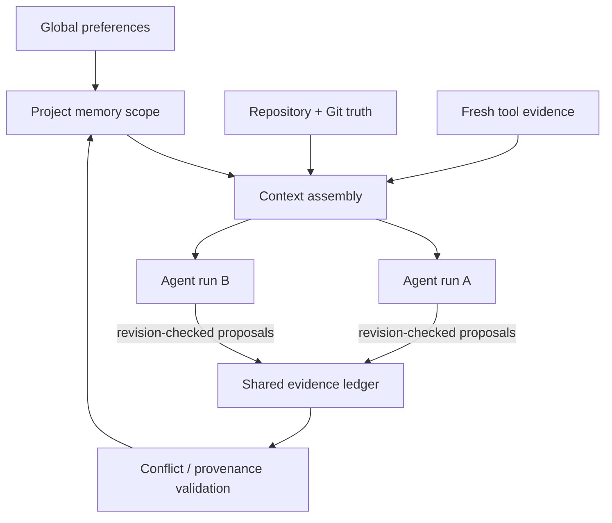

# Future coding-agent architecture

V1 deliberately reads authorized workspaces but does not modify repositories, run commands in real workspaces, manage Git, or orchestrate multiple autonomous agents. The current boundaries are designed so those capabilities can be added without turning remembered prose into authority.

## Scope inheritance

Future coding projects receive isolated memory scopes. A project may inherit selected global preferences, but repository files, test output, tool results, and Git history outrank remembered code summaries. Scope IDs must appear on events, claims, pages, vectors, graph edges, traces, and tool authorization.

## Repository truth

- Read the current file and Git state before acting on remembered implementation facts.
- Store code summaries as freshness-aware attributed conclusions.
- Invalidate or lower the rank of summaries when relevant paths or commits change.
- Preserve exact tool/file evidence so a claim can reopen the authoritative line or diff.
- Never treat a memory page as permission to write, execute, commit, push, or contact a service.

## Typed tool protocol

Tools should use provider-neutral, MCP-compatible schemas with explicit scopes, side-effect classes, authorization, idempotency, timeouts, and durable call/result events. Read operations and writes are separate tools. Destructive or externally visible actions require policy and user confirmation independent of model text.

Sandbox execution remains isolated from real workspaces by default. A future command runner should use a separately authorized worktree/container, bounded network policy, secret mediation, and captured stdout/stderr/artifacts.

## Multi-agent memory

Concurrent agents may read one evidence ledger but must not silently overwrite shared memory. Every write uses expected revision numbers and optimistic concurrency. Conflicts produce proposals or a reconciliation job. Agent conclusions remain attributed to agent/run IDs, and only verified tool evidence promotes repository facts.

## Coding-agent evaluation

Extend InfiniteBuild with real repository fixtures, issue-to-patch tasks, changing requirements, stale-summary traps, multi-agent conflicts, restart recovery, and long-horizon regression localization. Measure repository-grounded correctness, tool authorization, patch quality, test outcomes, provenance, token/cost efficiency, and recovery—not only conversational recall.

The one-session product promise remains the same: users should not manually hand off context between planning, research, implementation, debugging, and review sessions. Internally, each run still receives a finite, auditable evidence packet.
